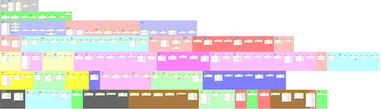

# Earthbound(1994) Narrative Flow Chart
A narrative flow chart from Earthbound(Mother 2) game

[Earthbound Wikipedia](https://en.wikipedia.org/wiki/EarthBound)

****
This is the product of a narrative structure study of the game. It is composed of conflict-solution-conclusion tables that are connected to each other and those follow a pretty much linear path.
****
Since Earthbound is partly an open world game, this chart is one of likely many possible flows that could come out from different emergent gameplay combinations.
****
There was an effort to not include core gameplay mechanics such as specific enemy combat tactics or power up tactics. For example this chart doesn't include "Ness needs to call his mom when he feels homesick and then he is healed", since that's not part of the main story leading to the end of the game. However, you will see that Ness picks up a specific item that will be used in a specific enemy combat later in the game, since that's the only way to unlock a location that's required to see the rest of the story.

> 
Please open a pull request/open an issue or just let me know if you want to contribute. Please note that all the tables in the chart has an id next to them, e.g. A1, B2 which can be used for follow up.

